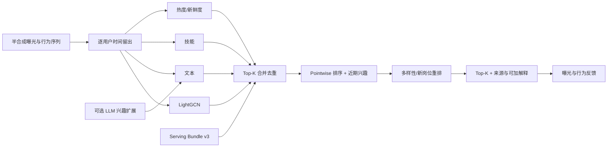

# JobRec-Feed：多阶段岗位内容推荐原型

JobRec-Feed 是一个面向推荐算法面试的自包含岗位内容流：固定种子半合成曝光数据经过
时间留出，LightGCN、文本、技能和热度/新鲜度四路召回产生候选，pointwise 模型结合
近期兴趣排序，最后进行多样性与新岗位探索重排。系统还提供证据受限的可选 LLM 兴趣
扩展、技能学习路径、内容哈希发布和曝光反馈归因。

> **事实边界**：原始真实数据已经丢失。所有实测只能证明代码路径、评估协议和工程
> 集成能够工作，不能证明真实 CTR、投递收益、生产吞吐或线上流量效果。

## 主链路



## 当前实现

- 曝光包含时间、位置、点击、停留、收藏和投递；协同图只使用正向训练行为；
- 正向交互按用户时间排序留出，测试边不会进入 LightGCN、热度或近期兴趣；
- 四路召回各取 Top-K，候选保留来源、路内分数和排名；
- 排序模型从训练曝光学习六项特征：协同、文本、技能、热度、新鲜度、近期兴趣；
- 排序 logit 等于各特征贡献、截距和重排调整之和；
- 已知用户屏蔽训练期岗位；冷启动和协同冷岗位可退化到内容信号；
- LLM 只生成带输入证据的结构化兴趣，Schema/证据校验失败后确定性降级；
- Bundle 将数据、checkpoint、排序参数、文本配置和重排配置纳入 Serving 哈希；
- 反馈必须对应唯一曝光，并可记录点击、停留、收藏、投递和可选满意度。

## 快速开始

```bash
uv sync --frozen --extra dev
uv run python -m pytest -q
uv run uvicorn src.api.routes:app --host 127.0.0.1 --port 8000
```

离线发布和实验：

```bash
uv run python main.py build-bundle --epochs 20
uv run python main.py experiments
```

打开 `http://127.0.0.1:8000/demo`，或在 `/docs` 查看 OpenAPI。

## API

| 接口 | 作用 |
|---|---|
| `GET /api/model` | 查看完整 Serving 身份、训练配置和排序类型 |
| `POST /api/recommend` | 多路召回、学习排序、重排、候选来源与兴趣扩展模式 |
| `POST /api/competency` | 技能差距与有来源的先修路径 |
| `POST /api/feedback` | 将行为反馈精确关联到曝光和模型版本 |
| `GET /health/live`、`/health/ready` | 区分进程存活和产物就绪 |

外部 LLM 默认关闭。配置 `JOBREC_LLM_ENDPOINT`、`JOBREC_LLM_MODEL` 和
`JOBREC_LLM_API_KEY` 后使用 OpenAI-compatible JSON 接口；未配置、超时或证据校验失败
都返回 `deterministic_fallback`，默认测试不访问网络。

## 当前实测

**已验证（2026-08-02，40 用户 × 100 岗位，五种子）**：固定权重融合 Recall@10
为 `0.2551`；学得的 pointwise 排序为 `0.1410`；多阶段系统为 `0.1436`，候选
Recall@80 为 `0.7109`。复杂排序没有领先，主要受半合成曝光稀疏、约 10% 正例率和静态
特征限制；负面结果完整保留。

多阶段重排相对 pointwise 的平均列表多样性从 `0.8433` 变为 `0.8445`，新岗位占比从
`0.3745` 变为 `0.3766`。变化很小，只证明重排方向和度量链路可运行。

完整协议见[数据、指标与证据](docs/data-and-evaluation.md)。

## 文档

- [架构、模块体系与功能计划](docs/architecture.md)
- [数据、指标与实测](docs/data-and-evaluation.md)
- [面试讲解与简历边界](docs/interview-guide.md)
- [关键问题与解决证据](docs/problem-solving.md)
- [开发规约](AGENTS.md)
