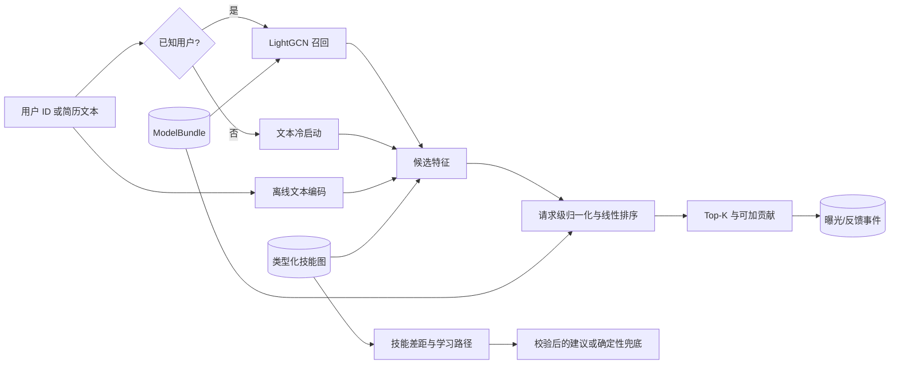

# JobRec-KG：岗位推荐与能力评估原型

JobRec-KG 是一个为求职项目展示而维护的、可离线复现的推荐系统原型。它把
LightGCN 协同召回、文本召回、技能图谱证据、线性排序、能力差距分析、模型产物
发布和 FastAPI 服务串成一条可测试的离线到在线链路。

> **证据边界**：原始真实数据已经丢失，当前仓库只能使用固定种子生成的半合成
> 数据。实验结果用于证明实现、协议和集成可以运行，不能证明真实用户效果、线上
> 收益、生产规模、公平性、隐私合规或服务等级。旧材料中的真实数据规模和业务
> 指标均不作为当前项目成果。

## 项目能展示什么

- **推荐链路**：已知用户使用 LightGCN、离线文本特征和技能覆盖融合；未知用户
  显式切换到文本与技能冷启动路径。
- **评估完整性**：逐用户留出测试集，训练图只使用训练交互，BPR 负采样排除已见
  岗位，评估与服务屏蔽训练期已见岗位。
- **离线/在线一致性**：训练状态通过校验后的 `ModelBundle` 发布；API 在 lifespan
  中一次加载，不在请求内重训。
- **可解释排序**：归一化限定在单次候选集，返回的各因子贡献与最终排序分数使用
  同一组特征和权重。
- **知识图谱证据**：学习路径只读取带方向、置信度和来源的
  `PREREQUISITE_OF` 边；默认使用内存图，也提供 Neo4j 适配器。
- **可靠生成**：职业建议使用 Pydantic 约束；外部 OpenAI-compatible 服务不可用
  或输出非法时，返回确定性的证据兜底内容。
- **合成用户评估**：Persona 约束的可选 LLM 判断只估计潜在人岗相关性，独立的
  位置观察模型再生成点击、收藏、投递与满意反馈；结果与真实反馈统计完全隔离。
- **服务工程**：FastAPI 提供推荐、能力评估、招聘方反向匹配、反馈、趋势和管理
  指标接口；曝光以唯一 ID 关联反馈并拒绝重复，事件写入 SQLite/WAL；演示鉴权和
  个人档案的姓名、手机、邮箱、通讯地址在进入 SQLite 前逐字段 AES-GCM 加密，只有
  本人或管理员可以通过 API 解密读取。

## 系统主链路



完整边界和设计决策见[架构文档](docs/architecture.md)。

## 快速开始

前置条件：`pyproject.toml` 支持的 Python 版本和
[`uv`](https://docs.astral.sh/uv/)。所有命令从仓库根目录执行。

```bash
uv sync --frozen --extra dev
uv run python -m pytest -q
uv run uvicorn src.api.routes:app --host 127.0.0.1 --port 8000
```

访问 `http://127.0.0.1:8000/demo` 查看使用正式 API 的演示页，或访问
`http://127.0.0.1:8000/docs` 查看 OpenAPI。默认演示账号为 `user_001`，密码为
`jobrec-demo`；管理员和招聘方使用独立的开发密码。所有默认凭据仅用于本机演示，
共享部署必须通过环境变量覆盖。

根 `main.py` 是只做委托的便利入口；不带子命令时只显示帮助。需要重新发布模型产物
或运行多种子实验时，可以使用：

```bash
uv run python main.py build-bundle --epochs 20
uv run python main.py experiments
uv run python main.py simulate-users --judge deterministic
```

它们分别调用 `scripts.build_model_bundle` 和 `src.experiments` 的唯一规范实现，不在
入口中复制训练逻辑。可选公开数据准备路径见
[数据与评估](docs/data-and-evaluation.md#3-外部数据获取与隔离准备)。

可选外部适配器默认关闭，启用方法见[架构文档的配置表](docs/architecture.md#8-配置与外部适配器)。

## API 概览

| 接口 | 作用 | 权限 |
|---|---|---|
| `POST /api/token` | 获取演示 Bearer token | 公开 |
| `POST /api/recommend` | 已知用户或冷启动岗位推荐 | user/admin |
| `POST /api/competency` | 指定岗位的能力差距与学习建议 | user/admin |
| `POST /api/profile`、`GET/DELETE /api/profile/{user_id}` | 加密保存、授权读取或删除四项个人字段 | 本人/admin |
| `POST /api/recruit/match` | 招聘方候选人反向匹配 | recruiter/admin |
| `POST /api/feedback` | 按 `impression_id` 记录一次推荐反馈 | user/admin |
| `GET /api/effectiveness` | 汇总已记录反馈 | admin |
| `GET /api/trends/hot-jobs` | 演示数据趋势聚合 | user/recruiter/admin |
| `GET /health/live`、`/health/ready` | 存活与就绪检查 | 公开 |

API 形状以 `src/api/routes.py` 的 Pydantic 模型和契约测试为准。

## 当前可复核证据

- **已验证（2026-07-31，本地 Python 3.13）**：28 个测试与 50% 覆盖率门槛通过；
  compile、Black、Isort 和关键边界 mypy 通过。
- **已验证（2026-07-19，半合成、五种子）**：技能基线的平均 Recall@10 为
  0.2145；加入 GAT 权重的融合模型为 0.2057。复杂模型没有超过简单技能基线，
  这是保留并需要解释的负面结果。
- **已验证（2026-07-31，半合成、确定性 Persona 基线）**：对发布 bundle 的
  20×Top-10 推荐执行潜在匹配判断与位置偏置行为模拟；`ProxyEffectiveness@10`
  为 12.0%。该数值只校验协议，不是 LLM 结果或真实用户有效率。
- **已验证（2026-07-15，单机冒烟）**：100 个请求、并发 10、错误率 0%，
  P95 103.91 ms。该结果不是耐久压测、多 worker 验证或生产 SLO。
- **环境受限**：Docker/Compose 和 Neo4j 适配代码已提供，但当前保留证据没有证明
  容器运行、Neo4j 集成稳定性或生产部署能力。

完整协议、均值/标准差和限制见[数据与评估](docs/data-and-evaluation.md)，机器可读
结果见 [`results/`](results/README.md)。

## 文档导航

- [文档体系与阅读路线](docs/README.md)
- [架构与设计约束](docs/architecture.md)
- [数据、实验协议与验证结果](docs/data-and-evaluation.md)
- [简历表述、演示顺序与面试问答](docs/interview-guide.md)
- [开发问题与解决方案](docs/problem-solving.md)
- [开发与文档规约](AGENTS.md)
- [外部参考资料说明](ref/README.md)

## 仓库结构

```text
src/        模型、召回、排序、图谱、生成、合成用户评估、API、指标
scripts/    模型发布、实验、合成用户评估、Neo4j 导入、负载冒烟
tests/      数据泄漏、模型、排序、安全、持久化和 API 契约测试
data/       半合成数据、本地运行状态和被忽略的外部 staging
models/     版本化服务 bundle 与 checkpoint
results/    机器可读实验和验证证据
docs/       当前维护的设计、证据与面试说明
ref/        外部研究资料和历史赛题文件
```

任何新结论或改动都应遵守 [`AGENTS.md`](AGENTS.md) 的证据、代码、测试和文档规则。
