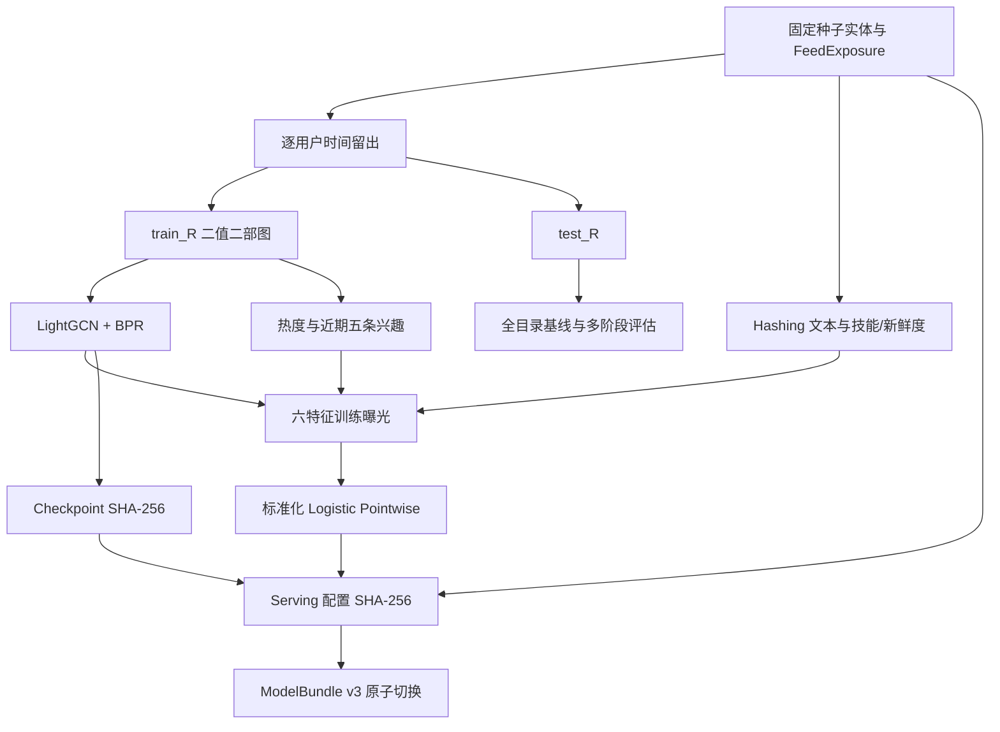
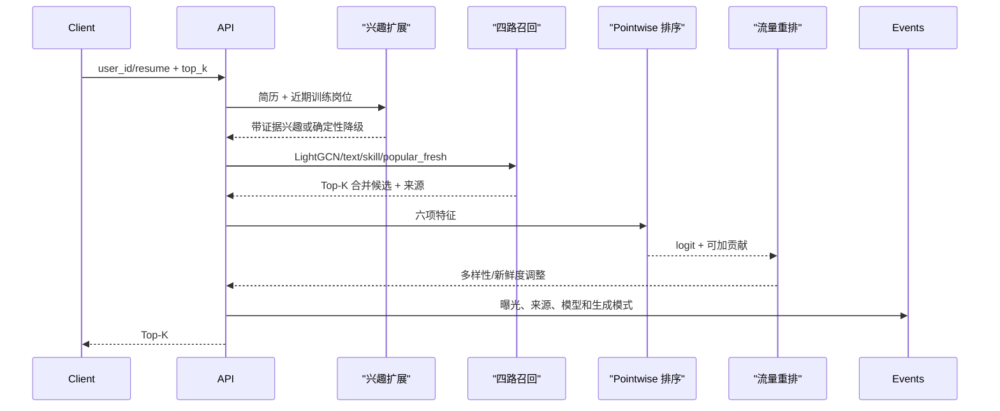

# 多阶段岗位内容流架构

本文定义当前技术契约。项目借鉴内容 Feed 的召回、排序和流量重排问题，但领域仍是岗位
推荐：用户长期目标比短视频稳定，技能等级是强约束，投递是低频结果，不能把一次点击
直接解释为求职成功。

## 1. 产品输入与输出

输入是已知用户 ID 或简历文本。推荐响应包含岗位、最终 logit、特征贡献、召回来源、
已知/冷启动模式、兴趣扩展模式、模型版本和唯一曝光 ID。能力接口另外返回技能差距和
有来源的先修路径。

系统不是简历解析产品、招聘交易平台或生产流量系统；真实数据治理、在线训练和正式
A/B 实验仍是范围外能力。

## 2. 数据协议

每条离线 `FeedExposure` 包含时间、位置、点击、停留、收藏和投递。排序正例定义为：

```text
clicked OR saved OR applied OR dwell_seconds >= 20
```

该定义用于生成数据上的 pointwise 演示，不代表真实招聘目标。协同边只来自曝光后的
正向行为。每个用户的正向交互按时间排序，最后约 20% 留作测试；训练图、热度、近期
兴趣和 BPR 正例只来自其余部分。无协同边岗位仍保留在目录中，由内容通道召回。

## 3. 离线训练与发布



LightGCN 使用二值用户—岗位二部图，不在传播邻接中增加自环；第 0 层 embedding 已在
最终层平均中保留自身信息。BPR 负样本只能从用户训练期未见岗位中抽取。

Pointwise 排序使用六项静态/训练期特征：`lightgcn`、`text`、`skill`、`popularity`、
`freshness` 和 `recent_interest`。模型保存均值、标准差、系数和截距，在线 logit 可逐项
核对。这不是深度排序或多任务学习；当前曝光证据不足以合理支撑更复杂模型。

## 4. 在线多阶段流程



每路精确取 Top-K 后合并。当前目录很小，精确排序比 ANN 更容易复核；接口已经把索引
实现与候选协议分离，只有在十万级目录且精确计算成为瓶颈时才引入 FAISS 等 ANN，并
联合验收候选 Recall、构建时长、内存和延迟。

已知用户使用四路召回并屏蔽训练岗位。新用户不构造协同历史；没有训练边的新岗位仍可
进入文本、技能和新鲜度通道。

## 5. 生成式兴趣扩展

可选适配器调用 OpenAI-compatible JSON 接口，把简历和近期岗位转为兴趣、负向偏好、
扩展 query 和逐项证据。每个兴趣/query 必须存在输入证据；Pydantic 校验、网络错误或
超时都会落到确定性技能词提取。

默认环境只验证 fallback，外部 LLM 为**环境受限**。当前实验没有 LLM 消融结果，不能
声称生成式扩展提升 Recall。LangGraph 未引入，因为单次结构化调用没有需要状态图解决的
分支复杂度。

## 6. 流量重排

Pointwise 结果之后使用确定性贪心重排：

```text
adjusted = relevance + freshness_bonus - diversity_penalty
```

相似度由技能 Jaccard、同公司和同岗位标题组成。重排目标是展示相关性与目录分发的权衡，
不代表公平配额、商业流量策略或线上收益。最终响应把调整量作为独立贡献，因此最终分数
仍能核对。

## 7. 发布身份与故障边界

`ModelBundle v3` 保存数据哈希、LightGCN checkpoint 哈希、训练配置、映射、seen set、
Pointwise 参数、文本配置和重排配置。`serving_sha256` 覆盖所有会改变当前在线排序的配置，
模型版本由该哈希导出；修改排序权重不会继续沿用旧模型版本。

服务在 FastAPI lifespan 中一次性加载并校验产物。请求内不训练、不改模型；外部 LLM
失败只影响兴趣扩展，不影响确定性推荐主线。SQLite 事件库用于单机演示归因，不是消息
队列或生产行为仓库。

## 8. 模块体系

| 模块 | 职责 |
|---|---|
| `src/data/` | 实体、曝光、时间切分、协同图、技能图 |
| `src/recall/` | LightGCN、文本信号、多路候选协议 |
| `src/ranking/feature_builder.py` | 离线/在线共享六项特征 |
| `src/ranking/pointwise.py` | 可学习 Logistic 排序与可加解释 |
| `src/ranking/reranker.py` | 多样性和新岗位探索 |
| `src/generation/` | 证据受限兴趣扩展和确定性降级 |
| `src/models/` | Serving Bundle 身份与校验 |
| `src/experiments/` | 同切分基线、多阶段与分发指标 |
| `src/metrics/` | 曝光和行为反馈精确归因 |
| `src/api/` | 在线编排、能力路径和演示接口 |

## 9. 后续触发条件

| 能力 | 当前状态 | 增加条件 |
|---|---|---|
| 预训练双塔/ANN | 目标 | 文本基线成为瓶颈且目录规模需要近似检索 |
| DIN/Transformer 序列 | 目标 | 获得足够长、严格按时点构造的行为序列 |
| 多任务排序 | 目标 | 点击、收藏、投递标签量足够且目标权衡明确 |
| LLM 离线消融 | 环境受限 | 固定模型、预算、缓存和人工证据评审协议 |
| 在线 A/B | 目标 | 有真实随机流量、实验单元和护栏指标 |
| 图数据库 | 目标 | 技能边需要在线更新、多跳审计或共享服务 |

当前实现不证明真实 Feed CTR、实时特征、新鲜内容收益、在线探索安全性、生成模型效果或
生产吞吐。
