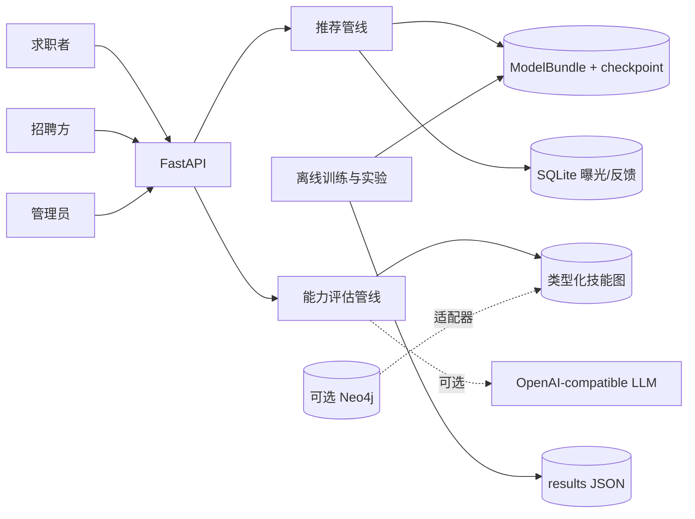
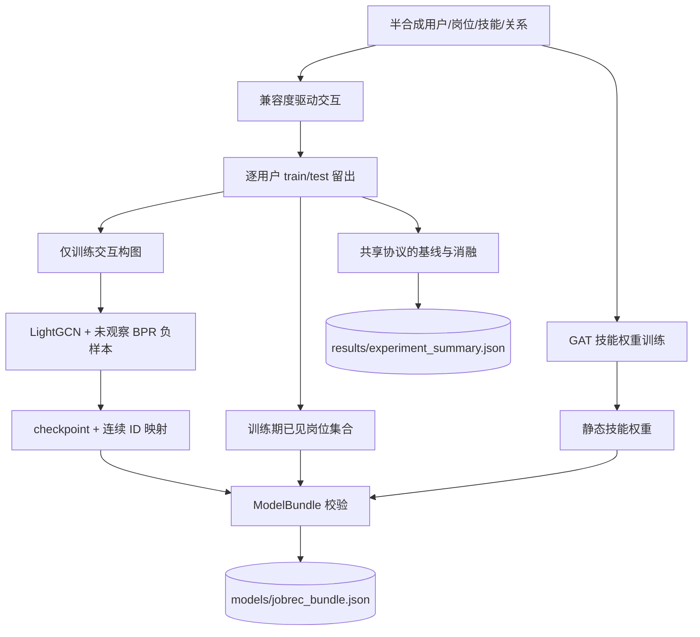
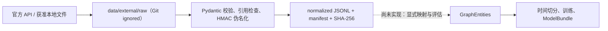
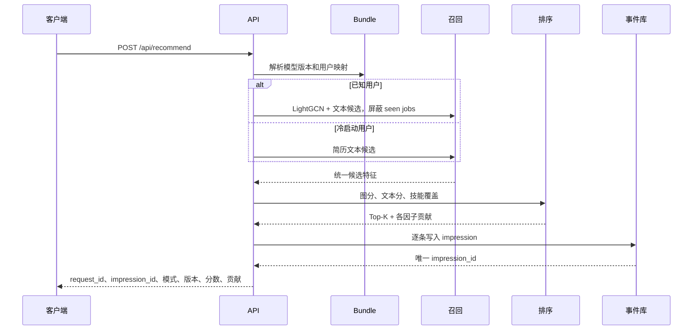
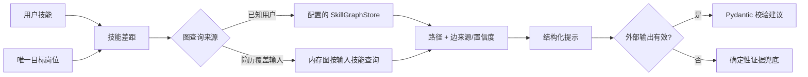

# JobRec-KG 架构与设计约束

> 状态：当前实现的设计说明。实验数值由
> [`data-and-evaluation.md`](data-and-evaluation.md) 维护。

## 1. 范围

本仓库展示一个自包含的岗位推荐与能力评估原型：离线阶段从半合成数据训练并发布
模型产物；在线阶段加载只读产物，区分已知用户与冷启动路径，返回排序证据，记录
曝光和反馈，并按目标岗位生成技能差距与学习路径。

系统默认不需要互联网：文本编码使用 feature hashing，技能图使用内存适配器，
建议生成使用确定性模拟器/兜底。Sentence-BERT、Neo4j 和外部 LLM 均为显式开启
的适配器，不属于默认验证路径。

### 1.1 可行性结论

- **已验证可行**：固定种子半合成数据上的训练、统一实验、bundle 发布、只读服务、
  推荐解释、能力评估和精确曝光反馈可在本机离线复现。
- **有条件可行**：公开岗位/职业本体可按许可进入隔离 staging；完成技能映射、时间
  切分、lineage 和新回归测试后，可用于独立外部数据实验。
- **当前不可证明**：真实用户效果、生产规模、公平/隐私合规、Neo4j/LLM 外部服务
  稳定性和线上闭环。扩大合成规模或成功导入岗位都不能填补这些证据。

## 2. 系统上下文



角色权限是演示级 HMAC Bearer 控制：求职者访问自身推荐与反馈；招聘方访问反向
匹配；管理员查看模型、效果和运行指标。它用于展示边界设计，不等于生产身份系统。

## 3. 组件与职责

| 层 | 职责 | 主要实现 |
|---|---|---|
| 配置 | 模型、数据和系统默认参数 | `src/config/settings.py` |
| 领域数据 | User、Job、Skill、Interaction、类型化关系 | `src/data/models.py` |
| 数据生成/加载 | 半合成实体、兼容度驱动交互、稀疏矩阵与切分 | `src/data/generator.py`、`src/data/loader.py` |
| 外部数据 staging | 来源无关契约、引用校验、用户 ID 伪名化与 manifest | `src/data/external.py`、`scripts/fetch_usajobs.py` |
| 图存储 | 内存图与 Neo4j 的能力证据契约 | `src/data/graph_store.py` |
| 协同召回 | LightGCN 传播、BPR 训练与推荐 | `src/recall/lightgcn.py` |
| 文本召回 | 默认 feature hashing，可选 Sentence-BERT/FAISS | `src/recall/sbert_recall.py` |
| 候选融合 | 合并协同和文本候选 | `src/recall/ensemble_recall.py` |
| 技能证据 | GAT 技能权重与等级感知覆盖率 | `src/models/gat.py`、`src/ranking/` |
| 排序 | 请求级归一化、线性融合、可加解释 | `src/ranking/linear_fusion.py` |
| 能力评估 | 技能差距、图路径、结构化建议与兜底 | `src/generation/` |
| 服务 | 鉴权、编排、推荐、评估、反馈、健康与指标 | `src/api/routes.py`、`src/security.py` |
| 持久化 | SQLite/WAL 曝光反馈；四字段加密个人档案 | `src/metrics/event_store.py`、`src/data/private_profile_store.py` |
| 实验 | 指标、基线、消融、公平性诊断、负载冒烟 | `src/experiments/`、`src/metrics/`、`scripts/` |
| 发布 | `ModelBundle` schema 与离线构建入口 | `src/models/bundle.py`、`scripts/build_model_bundle.py` |
| 命令入口 | 只分派到发布、实验或服务的规范实现 | `main.py`、`src/cli.py` |

根入口不实现训练、排序或生成逻辑。`build-bundle` 委托离线发布脚本，
`experiments` 委托共享实验 runner，`serve` 只加载现有 bundle；无子命令时只显示
帮助。这样避免旧演示入口单独覆盖 checkpoint、复制技能边或形成第二套评估协议。

推荐的学习主线是 `data/loader → utils/training → models/bundle → api/routes →
metrics/event_store`；`metrics/ab_test.py`、`online_metrics.py`、`llm_eval.py` 等是
独立分析工具，当前不在默认 API 或实验验收链路中，不能仅凭文件存在声称已集成。

## 4. 离线训练与发布



`ModelBundle` 同时保存 schema/model 版本、checkpoint 路径、用户/岗位映射、训练期
已见集合、技能权重和排序权重。API 加载时校验映射与当前固定种子数据一致；bundle
缺失或损坏时就绪失败，不静默训练一个替代模型。

测试集是边界而不是事后计算：测试交互不能进入训练邻接矩阵、BPR 已观察集合、
训练统计或服务端 seen set。具体协议见[数据与评估](data-and-evaluation.md)。

外部数据先进入被 Git 忽略的 `data/external/` staging。校验器生成岗位/交互 JSONL
和包含来源、许可、获取时间、输入哈希、行数及限制的 manifest；交互用户 ID 必须
HMAC 伪名化。成功 staging 不会自动改变训练或服务数据源，真正接入仍需显式实现
`GraphEntities` 映射、时间切分、bundle lineage 和对应回归测试。



## 5. 在线推荐



冷启动响应中的 LightGCN 分数为不可用状态的零值，`retrieval_mode` 明确为
`cold_start_semantic_skill`，不能暗示协同信息存在。已知用户路径依据 bundle 中的
映射和训练期 seen set。

排序器不持有跨请求归一化状态。对当前候选矩阵逐列 Min-Max 归一化后，用 bundle
中的线性权重计算分数；响应贡献来自同一个归一化矩阵，所以贡献之和等于排序分数
（展示时的独立四舍五入除外）。

## 6. 能力评估与图证据

能力接口必须通过 `job_id` 或唯一精确标题确定目标岗位，然后基于与排序相同的岗位
技能要求计算差距。



已知用户且未用请求文本覆盖资料时，能力接口调用当前配置的 `SkillGraphStore`；因此
Neo4j 开启时，响应中的 `evidence_source` 与实际查询一致。传入简历文本时，外部图
没有该临时用户状态，接口明确使用内存关系按解析技能查询，并报告内存来源。

LLM 失败是预期分支：网络异常、非法 JSON 或 schema 不合格均回退到根据技能差距
构造的 `CareerAdvice`。兜底不是“LLM 质量已验证”，也不得绕过图证据。

## 7. 生命周期、事件与可观测性

FastAPI lifespan 启动时生成固定种子演示实体、校验并加载 bundle、计算只读 embedding、
初始化图适配器、SQLite 事件库和加密个人档案库；关闭时释放支持 `close()` 的外部图
连接。请求携带的简历文本只用于当次召回/能力分析，不写入事件库或个人档案库。

- `/health/live` 仅说明进程能响应。
- `/health/ready` 依赖管线、模型和图健康检查。
- `/api/model` 暴露 model/schema 版本与图来源。
- `/api/metrics` 仅提供进程内请求数、平均处理时间和 uptime。

每次推荐生成一个 `request_id`，每个结果先写入 `impression` 并返回唯一
`impression_id`。`POST /api/feedback` 必须携带该 ID；事件库逐项校验用户、岗位和
模型版本，并用唯一索引拒绝同一曝光的重复反馈，错配或重复均返回 409。事件库启动时
会迁移旧事件表，但无唯一曝光关联的旧 feedback 不进入新统计。严谨在线实验仍需要
客户端事件 ID、实验分组、曝光有效期、迟到/撤回和缺失反馈处理规则。

SQLite/WAL 适合本机持久化演示，不是多机事件平台；进程内指标不是监控系统或 SLO。

## 8. 配置与外部适配器

| 环境变量 | 用途 | 默认行为 |
|---|---|---|
| `JOBREC_BUNDLE_PATH` | 模型 bundle 路径 | `models/jobrec_bundle.json` |
| `JOBREC_EVENT_DB` | SQLite 事件库路径 | `data/jobrec_events.sqlite3` |
| `JOBREC_PROFILE_DB` | 加密个人档案库路径 | `data/jobrec_profiles.sqlite3` |
| `JOBREC_PROFILE_MASTER_KEY` | 个人字段加密主密钥 | 不安全的开发默认值 |
| `JOBREC_TOKEN_SECRET` | 演示 token HMAC 密钥 | 不安全的开发默认值 |
| `JOBREC_DEMO_PASSWORD` | 演示账号密码 | `jobrec-demo` |
| `JOBREC_ADMIN_PASSWORD` | 演示管理员密码 | `jobrec-admin-demo` |
| `JOBREC_RECRUITER_PASSWORD` | 演示招聘方密码 | `jobrec-recruiter-demo` |
| `JOBREC_USE_PRETRAINED_SBERT` | 设为 `1` 启用预训练模型 | 默认离线 feature hashing |
| `JOBREC_GRAPH_BACKEND` | 设为 `neo4j` 启用外部图 | 默认内存图 |
| `NEO4J_URI`、`NEO4J_USER`、`NEO4J_PASSWORD` | Neo4j 连接 | 无生产默认配置 |
| `JOBREC_LLM_ENDPOINT`、`JOBREC_LLM_API_KEY`、`JOBREC_LLM_MODEL` | 可选生成端点 | 默认确定性模拟/兜底 |

可选适配器示例：

```bash
JOBREC_USE_PRETRAINED_SBERT=1 uv run uvicorn src.api.routes:app
NEO4J_PASSWORD=... uv run python -m scripts.seed_neo4j
JOBREC_GRAPH_BACKEND=neo4j NEO4J_PASSWORD=... uv run uvicorn src.api.routes:app
```

启用预训练模型可能下载权重；外部 LLM 必须同时设置 endpoint 和 API key。任何密钥
都不得写入命令历史示例、仓库、日志或报告。

## 9. 安全与隐私边界

- token 采用演示级 HMAC 签名并校验角色、过期和篡改；user、recruiter、admin 使用
  不同密码来源，普通用户密码不能换取高权限令牌。仍没有 OIDC、刷新、撤销或生产
  密钥轮换。
- `EncryptedProfileStore` 对姓名、手机、邮箱、通讯地址四项逐字段使用 AES-GCM；
  每次写入使用随机 salt/nonce，PBKDF2 派生 256-bit key，并把 `user_id + field`
  作为 AAD，防止密文跨用户或字段调换。
- API 只允许本人或 admin 保存、解密读取和删除档案；recruiter 只能看到反向匹配所需
  的演示用户 ID 和技能结果，不能读取联系方式。
- 请求简历不落库，日志和事件 payload 不记录简历、个人字段、token 或密钥。
- 共享部署仍需托管身份、KMS、最小权限、审计、传输/静态加密、保留与删除策略、
  SQLite/备份安全擦除、威胁建模和独立安全评审。

因此可以说“**已验证赛题要求的四字段数据库加密和授权解密演示**”，不能说“通过
安全审计”“符合 GDPR/PIPL”或“生产隐私合规”。

## 10. 关键决策与取舍

| 决策 | 当前选择 | 原因与限制 |
|---|---|---|
| 协同召回 | LightGCN + BPR | 能展示图协同训练；半合成稀疏数据上未胜过技能基线 |
| 冷启动 | 默认 feature hashing，可选 SBERT | 默认离线可复现；hashing 不是领域语义模型 |
| 最终排序 | 线性加权 | 数据量不足以支持复杂 LTR 结论，且贡献可精确解释 |
| 技能权重 | GAT 训练后静态发布 | 展示图特征流程；使用代理标签，不代表真实业务重要度 |
| 技能图 | 内存默认、Neo4j 可选 | 保持自包含，同时展示可替换存储边界 |
| 生成 | schema + 确定性兜底 | 把事实证据与文案生成解耦，外部模型质量未验证 |
| 事件存储 | SQLite/WAL | 足够本机演示，不宣称分布式吞吐或耐久性 |
| 个人档案 | AES-GCM 字段加密 + 本人/admin RBAC | 满足赛题演示条款；默认凭据和本地密钥不适合共享部署 |

## 11. 不变量与剩余缺口

开发必须保护训练/测试隔离、合法负采样、seen masking、bundle 发布、显式冷启动、
请求级归一化、可加解释、类型化图路径、schema 生成兜底、曝光后反馈和 lifespan
只读加载。完整开发要求见 [`../AGENTS.md`](../AGENTS.md)。

| 缺口或故障 | 当前行为 | 若获得合法新数据/目标部署后的工作 |
|---|---|---|
| bundle 缺失或映射不一致 | 启动/就绪失败 | 模型注册、校验和、审批、回滚 |
| 预训练文本模型不可用 | 默认 hashing 仍可运行 | 固定模型版本、缓存和领域评估 |
| Neo4j 不可用 | 默认内存图可运行 | 集成/故障测试和明确降级策略 |
| LLM 超时或非法输出 | 返回校验后的确定性兜底 | 预算、追踪、重试与人工质量评估 |
| 反馈迟到、重放或跨实验归因 | 精确曝光关联并拒绝重复反馈 | 实验分组、事件时钟、有效期与幂等消费 |
| 半合成分布偏差 | 只报告协议性结果 | 合法新数据的时间切分、漂移与在线验证 |
| 公平/隐私结论 | 四字段加密与授权解密已验证；公平性仍只有工具 | 托管身份/KMS、合法属性、治理流程和独立审计 |
| 生产性能 | 仅有单机小规模冒烟 | 多 worker、耐久、容量、故障和成本测试 |
