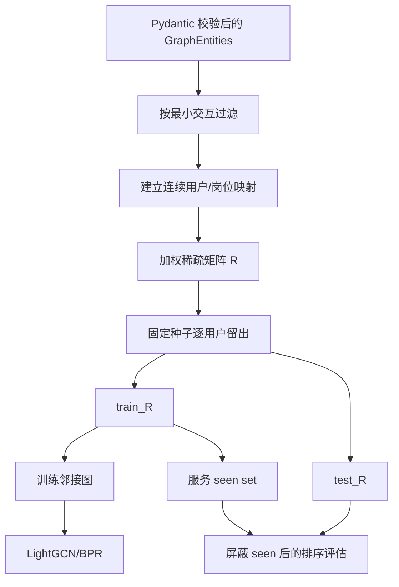

# 数据、实验协议与验证结果

> 状态：数据语义和数值证据的唯一详细说明。机器可读结果以 `../results/` 为准。

## 1. 数据事实与适用边界

原始真实数据已经丢失，仓库没有可恢复的真实简历、岗位、投递、面试或线上曝光日志。
当前默认数据由 `src/data/generator.py` 按固定种子生成，属于**半合成开发数据**。

它可以支持：

- 构造稳定的实体、关系和交互以运行完整链路；
- 验证切分、负采样、seen masking、指标和模型发布契约；
- 比较同一生成分布、候选池和种子策略下的基线与消融；
- 演示 API、解释、反馈持久化和外部适配器边界。

它不能支持：

- 真实求职者的推荐有效性、投递率、面试率或满意度结论；
- 真实市场分布、冷启动难度、季节性和反馈偏差估计；
- 受保护群体公平性、隐私合规或真实个人数据安全结论；
- 生产数据规模、吞吐、可用性、成本或服务等级结论。

旧材料中的真实规模或业务指标统一视为**历史未验证**，不进入当前实验基线。

## 2. 数据域与可执行契约

实体字段由 `src/data/models.py` 的 Pydantic 模型定义；本文说明语义，不复制完整
schema。

| 数据域 | 当前来源 | 主要用途 | 若未来获得合法新数据时的缺口 |
|---|---|---|---|
| 用户/简历 | 固定种子生成 | 文本召回、技能覆盖、能力评估 | 授权采集、解析/NER、身份和保留治理 |
| 岗位 | 固定种子生成 | 文本召回、技能匹配、反向匹配 | 合法 feed、时效、去重、地区/币种/类型 |
| 技能 | 维护中的演示词表 | 用户/岗位画像、GAT、解释 | 版本化本体、别名消歧和专家治理 |
| 技能关系 | 人工定义类型边 | 学习路径证据 | 来源审查、有效期、版本和复核状态 |
| 交互 | 兼容度驱动模拟 | LightGCN、离线评估、趋势 | 唯一事件、曝光 ID、时间语义、去重和偏差处理 |
| 在线事件 | API 本地写入 | 唯一曝光后的反馈诊断 | 持久事件平台、同意、删除、实验和迟到事件规则 |
| 私密个人档案 | API 演示输入 | 验证赛题四字段加密与授权解密 | 托管身份/KMS、同意、保留、备份和安全擦除 |

### 2.1 核心实体

- `Skill`：稳定 ID、展示名、类别和可选说明；等级为 `beginner`、
  `intermediate`、`advanced`、`expert`。
- `User`：内部 ID、演示姓名、教育/经验、技能映射和简历文本。简历文本在真实场景
  中属于敏感数据；当前 API 只做确定性词表匹配，不支持文件上传、OCR 或训练过的 NER。
- `JobPosting`：ID、标题、公司、描述、必需/加分技能和可选薪资范围。生成器把结构化
  技能名写入 JD，保证文本与结构化字段不自相矛盾。
- `Interaction`：用户、岗位、类型、时间。类型为 `view`、`click`、`save`、`apply`；
  稀疏矩阵对同一用户/岗位保留最强权重 0.5、1.0、1.5、2.0。这些权重是建模假设，
  不是转化率。
- `SkillRelation`：`source_skill_id -> target_skill_id` 表示
  `PREREQUISITE_OF`，同时保留 `[0,1]` 置信度和来源。

### 2.2 本地产物

| 产物 | 用途 | 生命周期 |
|---|---|---|
| `data/mock_data.pkl` | 可重建 `GraphEntities` 快照 | 可信本地 pickle，不是正式数据集 |
| `data/jobrec_events.sqlite3` | 曝光和反馈运行状态 | 被 Git 忽略，可随本机演示重建 |
| `data/jobrec_profiles.sqlite3` | 姓名/手机/邮箱/地址的 AES-GCM 密文 | 被 Git 忽略；默认开发密钥不可用于共享部署 |
| `models/jobrec_bundle.json` | 在线映射、seen set、权重和版本 | 发布契约 |
| `models/lightgcn_model.pt` | bundle 引用的 checkpoint | 与 bundle 成对生成 |
| `results/experiment_summary.json` | 五种子基线/消融 | 当前实验数值来源 |
| `results/coverage.json` | 记录运行的覆盖率明细 | 质量证据快照 |
| `results/load_test_summary.json` | 单机 API 负载冒烟 | 协议限定的性能证据 |

不要反序列化不可信 pickle/checkpoint，不要手工编辑模型权重和结果数字。

### 2.3 赛题 Data Privacy 验收矩阵

事实来源为 [`../ref/赛题.pdf`](../ref/赛题.pdf) PDF 第 3 页、印刷页码 71。原文有两层
要求：用户期望中要求保护简历个人数据、不侵犯隐私；技术指标要求数据库中姓名、手机、
邮箱、通讯地址等至少四项加密，且只能由授权人员解密。

| 赛题要求 | 当前实现 | 回归证据 | 结论 |
|---|---|---|---|
| 简历个人数据安全 | `resume_text` 只在请求内做技能提取/召回，不写入 SQLite 事件或档案；日志不记录请求体 | API 契约测试；代码审查 | **已验证（演示路径）** |
| 至少四项数据库加密 | `private_profiles` 只保存 `name/phone/email/address` 四列 AES-GCM 密文 | 数据库文件无四项明文断言、随机密文往返测试 | **已验证** |
| 只能由授权人员解密 | 仅本人或 admin 可写、读、删；recruiter 和其他用户均返回 403；三类角色使用独立密码来源 | API 权限契约测试 | **已验证（演示 RBAC）** |
| 密文篡改与调换拒绝 | 随机 salt/nonce；PBKDF2；AAD 绑定 `user_id + field` | 调换姓名/邮箱密文后认证失败 | **已验证** |

这里的“完成”只针对赛题明确的功能验收范围，不等于真实个人数据治理或法规认证。
共享部署仍缺 OIDC、KMS、密钥轮换、TLS 终止策略、访问审计、同意/撤回、保留期限、
备份清除和 SQLite 安全擦除。当前测试只使用生成/构造数据。

## 3. 外部数据获取与隔离准备

**已实现**：仓库提供来源无关的岗位/交互 JSONL 契约、引用校验、HMAC 用户 ID
伪名化、输入 SHA-256 和 lineage manifest。**未实现**：外部数据到
`GraphEntities`、训练、评估和在线 bundle 的自动切换；因此导入成功不能写成模型已在
该数据上训练。

### 3.1 可获取来源与用途

下表在 2026-07-30 按官方页面核对；下载前仍须复核最新条款和版本。

| 需要的数据 | 可选来源 | 适合用途 | 许可与限制 |
|---|---|---|---|
| 技能、职业、职业—技能关系 | [ESCO 下载/API](https://esco.ec.europa.eu/en/use-esco) | 多语言技能本体、稳定 URI、岗位技能映射 | 官方提供 CSV/ODS/RDF 与 API；固定版本并保留 attribution/适用许可 |
| 职业与技能要求 | [O*NET Database](https://www.onetcenter.org/database.html) | 北美职业画像、技能/知识维度、外部本体对照 | 当前数据库页面标明 CC BY 4.0；须标注 O*NET 数据和 USDOL/ETA，记录具体版本 |
| 当前公开岗位 | [USAJOBS Search API](https://developer.usajobs.gov/api-reference/get-api-search) | 岗位文本、组织、公开 URL、抓取/去重演示 | 需要注册邮箱和 API key；用途受 [API Terms](https://developer.usajobs.gov/guides/terms-of-use) 约束，不等同开放再分发许可 |
| 岗位推荐交互 | [XING RecSys Challenge 2017](https://www.recsyschallenge.com/2017/) | 曝光/点击/收藏/申请的离线协议研究 | All rights reserved、仅学术使用、禁止分享和商业用途；只有仍可合法获准时才在本地使用 |

这些来源彼此不能天然拼接：ESCO/O*NET 是本体或职业统计，USAJOBS 是公开岗位快照，
XING 是受限的匿名交互。把它们映射到同一 skill ID、用户/岗位空间仍是新的数据工程
工作，不能用标题相似或随机关联伪造“真实交互”。

不建议从招聘网站、社交网络或个人主页抓取简历。若需用户侧数据，应使用自己取得明确
同意的最小化样本，先定义目的、保留、删除和撤回流程；公开可见不等于允许批量训练。

### 3.2 USAJOBS 获取与标准化

先在终端之外通过本机 secret manager 或受控环境配置 `USAJOBS_EMAIL` 和
`USAJOBS_API_KEY`，再执行：

```bash
uv run python -m scripts.fetch_usajobs \
  --keyword "software data" \
  --pages 2 \
  --output data/external/raw/usajobs-jobs.jsonl
```

脚本只调用官方 Search API，并转换为 `ExternalJob` JSONL。USAJOBS 当前响应没有项目
所需的规范化技能等级，所以 `required_skills`、`preferred_skills` 保持为空；不能用
关键词命中冒充已验证的技能标签。随后生成受校验的 staging snapshot：

```bash
uv run python -m scripts.prepare_external_dataset \
  --jobs data/external/raw/usajobs-jobs.jsonl \
  --output-dir data/external/normalized/usajobs \
  --source-name USAJOBS \
  --source-url https://developer.usajobs.gov/api-reference/get-api-search \
  --license-name "USAJOBS API Terms" \
  --license-url https://developer.usajobs.gov/guides/terms-of-use \
  --retrieved-at 2026-07-30
```

输出目录包含 `jobs.jsonl`、空的 `interactions.jsonl` 和 `manifest.json`。manifest
记录来源、许可、获取/准备时间、行数、输入哈希和不能外推的边界。整个
`data/external/` 被 Git 忽略。

### 3.3 自有或获准交互的本地准备

交互输入每行只允许：

```json
{"user_id":"source-local-id","job_id":"usajobs:ABC","interaction_type":"click","timestamp":"2026-07-30T10:00:00Z"}
```

`job_id` 必须引用同批岗位，类型只能是 `view/click/save/apply`。在受控环境配置
`JOBREC_IMPORT_PSEUDONYM_KEY` 后，将 `--interactions` 传给同一准备脚本；缺少 key、
引用未知岗位或 schema 非法时会失败。输出只保留 HMAC 伪名 ID，原始 ID 不写入
normalized snapshot。

伪名化不等于匿名化，也不能代替访问控制、删除映射和同意管理。XING 等受限数据不得
提交到仓库或共享 normalized snapshot。对应构造式测试位于
`tests/test_external_data_and_cli.py`。

### 3.4 接入训练前的完成条件

外部 snapshot 真正进入模型前，至少还要：

1. 版本化技能别名/本体映射，并人工抽样复核；
2. 定义岗位时效、重复公告和撤回规则；
3. 按事件时间切分，保存候选池与曝光语义；
4. 让 bundle 记录 snapshot manifest 哈希、代码版本和转换配置；
5. 在新数据上重跑简单基线、泄漏反例和分层诊断；
6. 独立评估许可、个人数据、保留/删除和受保护属性治理。

在上述闭环完成前，外部脚本的证据标签只能是“数据准备路径**已实现**”，不是
“真实数据效果**已验证**”。

## 4. 半合成生成协议

默认生成器创建用户、岗位、技能、类型化关系、申请和交互。交互概率与强度由一个只在
生成阶段使用的 compatibility oracle 调节，信号包括：

- 必需技能的等级覆盖；
- 加分技能重合；
- 有界的经验匹配项。

这样做的目的不是模拟真实劳动力市场，而是让测试数据存在透明的可学习信号，避免用
完全随机交互评价推荐器。oracle 不进入模型特征，也不直接作为测试标签。

构造式测试验证观察交互对的平均 compatibility 明显高于未观察对，并验证生成 JD
包含其结构化必需技能。改变生成概率或分布时必须更新测试与本文。

## 5. 加载、切分与防泄漏协议



`src/data/loader.py` 必须满足：

1. `test_ratio` 位于 `[0,1)`；
2. 少于两次交互的用户只进入训练集；
3. 每个评估用户至少保留一个训练交互和一个测试正例；
4. `train_R + test_R` 的非零项与过滤后的原矩阵一致；
5. LightGCN 邻接只由 `train_R` 生成；
6. 评估和服务屏蔽该用户所有训练期岗位；
7. BPR 负候选排除该用户观察过的岗位；无合法负样本的用户从该批次剔除。

测试位于 `tests/test_core_pipeline.py`、`tests/test_data_graph_and_ranking.py` 和
`tests/test_security_persistence_and_statistics.py`。规则变化需要构造式回归测试，不能
只比较一个最终指标是否波动。

## 6. 指标定义

当前多模型实验统一计算：

- `Recall@10`：前 10 中命中的测试正例数 / 该用户测试正例数；
- `NDCG@10`：按排名折损的命中增益 / 理想增益；
- `MRR@10`：首个测试正例排名的倒数，无命中为 0；
- `Catalogue coverage@10`：所有评估用户 Top-10 覆盖的不同岗位数 / 岗位总数。

这些指标只衡量当前半合成 holdout 协议。SQLite 的 `effectiveness` 是已记录满意反馈
占全部反馈的比例；API 只接收与唯一 `impression_id` 的用户、岗位、模型版本完全匹配
的反馈，并拒绝同一曝光重复反馈。它仍不是旧赛题要求的真实用户调查，因为缺少样本
人群、实验分组、曝光有效期、无响应处理和调查流程。

## 7. 多种子基线与消融

**已验证：2026-07-19 重跑，结果与 2026-07-15 保留产物逐字节一致。** 命令：

```bash
uv run python -m scripts.run_experiments
```

协议：每个种子生成 40 用户、100 岗位；种子为 11、19、23、31、42；逐用户留出；
所有模型共享候选池和 seen masking；LightGCN 训练 15 epoch；默认文本模型为离线
feature hashing（产物沿用 `B3_sbert` 历史键名，但本次没有加载预训练 SBERT）。

| 模型 | Recall@10 均值±总体标准差 | NDCG@10 均值±总体标准差 | MRR@10 均值 | Catalogue coverage@10 |
|---|---:|---:|---:|---:|
| B0 Random | 0.1271 ± 0.0182 | 0.0985 ± 0.0160 | 0.1664 | 0.984 |
| B1 Popularity | 0.1048 ± 0.0213 | 0.0707 ± 0.0197 | 0.1070 | 0.210 |
| B2 Skill | **0.2145 ± 0.0335** | **0.1714 ± 0.0254** | **0.2734** | 0.922 |
| B3 Offline text | 0.1805 ± 0.0287 | 0.1329 ± 0.0155 | 0.2061 | 0.828 |
| B4 LightGCN | 0.1215 ± 0.0088 | 0.0866 ± 0.0080 | 0.1395 | 0.972 |
| E1 LightGCN + text | 0.1488 ± 0.0198 | 0.1191 ± 0.0122 | 0.2074 | 0.930 |
| E2 + uniform skill | 0.2018 ± 0.0295 | 0.1620 ± 0.0169 | 0.2700 | 0.936 |
| E3 + GAT skill | 0.2057 ± 0.0293 | 0.1643 ± 0.0161 | 0.2701 | 0.926 |

完整逐种子值在 [`../results/experiment_summary.json`](../results/experiment_summary.json)。
重跑前后 SHA-256 均为
`1c0dd1d2f2aa3e493b51945b37982140d70460bc4ed3091c5746c304c8c8f704`。

### 7.1 可以得出的结论

- 技能基线 B2 的均值最好，说明生成器的主要信号确实是技能兼容度。
- E3 相比 E2 只有很小的均值差异，当前协议不足以证明 GAT 权重有稳定收益。
- LightGCN 单路在该小型稀疏分布上弱于技能和文本基线；保留该负面结果比选择性报告
  复杂模型更可信。
- 融合链路的价值在当前阶段主要是接口、发布和解释能力，不是“效果领先”的证明。

### 7.2 不能得出的结论

- 表中没有真实标签，不能外推到真实投递、面试或用户满意度。
- 五个种子不是独立真实数据集，也没有统计显著性或外部基准复现。
- GAT 使用代理监督，不能把学到的权重解释为真实岗位市场的重要度。
- `B3_sbert` 的产物键名不代表本次运行了预训练 Sentence-BERT。

## 8. 工程验证

### 8.1 本地质量门禁

**已验证日期：2026-07-30；环境：macOS、Python 3.13、锁定 uv 环境。**

```bash
uv run python -m compileall -q src scripts tests main.py
uv run python -m pytest -q --cov=src --cov-report=term-missing --cov-fail-under=50
uv run black --check src scripts tests main.py
uv run isort --check-only src scripts tests main.py
uv run mypy src/api/routes.py src/models/bundle.py src/data/graph_store.py \
  src/generation/adapters.py src/security.py src/data/models.py \
  src/metrics/event_store.py src/data/private_profile_store.py \
  src/utils/crypto.py
```

当前复核结果：21 个测试通过，`src` 总行覆盖率 59.10%，compile、Black、Isort 与
上述关键服务边界的 mypy 均通过。精确覆盖率快照见
[`../results/coverage.json`](../results/coverage.json)。测试运行出现依赖侧弃用警告，
不影响本次通过结论，但不应误报为“零警告”。

### 8.2 API 负载冒烟

**已验证产物日期：2026-07-15。** 环境为本地 macOS、单 uvicorn worker、离线
feature-hashing 编码器。协议为 100 个请求、并发 10：

| 指标 | 结果 |
|---|---:|
| 错误率 | 0% |
| 吞吐 | 328.40 req/s |
| 平均延迟 | 26.05 ms |
| P50 | 7.90 ms |
| P95 | 103.91 ms |
| P99 | 223.80 ms |

原始摘要见 [`../results/load_test_summary.json`](../results/load_test_summary.json)。这是
功能/小负载冒烟，不是耐久、多 worker、1000 并发、故障恢复或生产 SLO 证明。

### 8.3 环境受限项

- Dockerfile 与 Compose 清单已静态提供，保留记录没有证明镜像实际构建和运行。
- Neo4j 适配器、Cypher 和导入脚本已实现；没有外部 Neo4j 的集成与故障证据。
- 可选预训练 Sentence-BERT 和外部 LLM 不在默认离线质量门禁中。
- 公平性模块只能展示指标计算，缺少合法真实群体属性与治理流程。
- Data Privacy 已满足赛题四字段加密和授权解密演示要求；生产身份、KMS、审计、
  同意、保留、备份与安全擦除仍未验证。

## 9. 若未来获得合法新数据

不得尝试“复原”已丢失数据或从公开个人页面无授权抓取。只有在获得新的合法、授权、
可治理数据后，才应另行定义：

- 数据所有者、使用目的、授权、保留与删除；
- 跨系统唯一事件/曝光 ID、事件时间、模型版本、位置和实验分组；
- 岗位时效、去重、技能本体版本和简历解析证据；
- 按时间切分、反馈延迟、冷启动与候选池构造；
- 漂移、缺失、选择偏差、受保护属性使用和独立审计；
- 模型注册、回滚、线上实验和容量/故障测试。

在这些条件满足前，项目的诚实结论是“面试级、协议可复现原型”，不是“真实业务
推荐系统”。
